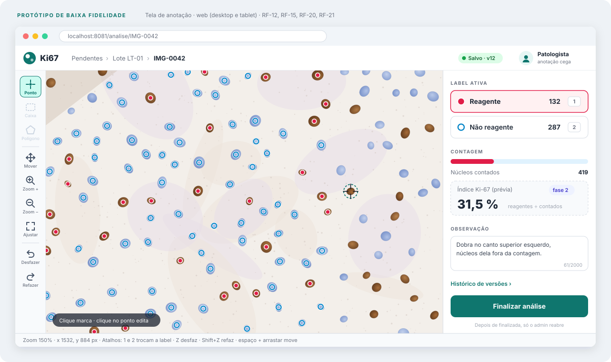
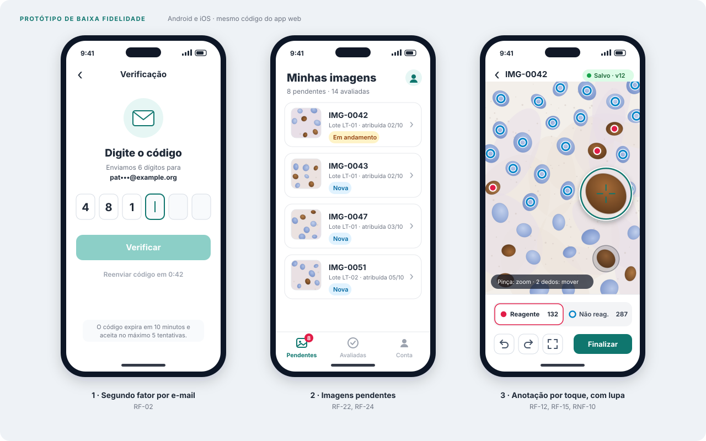
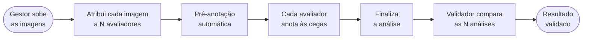

<div align="center">

# Ki67

**Anotação cega e versionada de imagens de imuno-histoquímica Ki-67, na web, no Android e no iOS, a partir de uma única base de código.**

[](docs/03-planejamento.md)
[](docs/01-visao-e-requisitos.md#7-requisitos-não-funcionais)
[](https://docs.expo.dev/versions/latest/)
[](https://www.typescriptlang.org/)
[](https://supabase.com/docs)
[](https://developers.cloudflare.com/r2/)
[](LICENSE)

[Visão e requisitos](docs/01-visao-e-requisitos.md) · [Arquitetura](docs/02-arquitetura.md) · [Planejamento](docs/03-planejamento.md)

</div>

> [!NOTE]
> **Etapa 1 · documentação inicial.** O repositório ainda não tem código: esta entrega descreve o app que o grupo constrói a partir da Sprint 0. As imagens abaixo são protótipos, e o passo a passo de [Como rodar do zero](#como-rodar-do-zero) é o procedimento-alvo, testado em outra máquina a cada entrega. A documentação é viva e muda junto com o código.

## O que é

O **Ki67** é uma plataforma para estudos com o marcador Ki-67. O gestor do projeto distribui imagens de lâminas a quantos avaliadores quiser, cada avaliador marca de forma independente e cega quais núcleos são reagentes (marrons) e quais não são (azul-claros), e um validador compara as análises da mesma imagem com métricas de concordância. Cada salvamento vira uma versão e cada ação entra num log que ninguém altera.

<p align="center">
  
</p>
<p align="center">
  
</p>
<p align="center"><sub>Protótipos de baixa fidelidade. Quando as telas existirem, capturas reais e um GIF da anotação substituem estas imagens.</sub></p>

### Como funciona



Cada passo gera um registro no log de auditoria. O gestor define o N de cada lote (o padrão é 3).

| No MVP | Na fase 2 |
| --- | --- |
| Login com e-mail, senha e código enviado por e-mail (2FA) | Aba Em andamento |
| Usuários e papéis cadastrados pelo admin; projetos conduzidos por um gestor | Diff entre versões |
| Upload em lote, com hash SHA-256 de cada original | Versionamento das imagens |
| Anotação por pontos, caixas e polígonos, com zoom, pinça e desfazer | Labels configuráveis |
| Pré-marcação dos núcleos não reagentes e imagem já pré-anotada | Reabertura de análise finalizada |
| Índice Ki-67 calculado na tela | Modo offline completo |
| Comparação das N análises e métricas de concordância | |
| Cegamento garantido pela API, não só pela tela | |
| Salvamento automático, versões e histórico com restauração | |
| Log de auditoria que ninguém edita ou apaga | |
| Exportação no formato do Labelme e em CSV | |

## Stack

| Camada | Tecnologias e versões |
| --- | --- |
| App (web, Android e iOS) | Expo SDK 57 · React Native 0.86 · React 19.2 · React Native Web 0.21 · TypeScript 6.0 |
| Navegação | Expo Router 57, sobre o React Navigation |
| Estado | Zustand 5 (editor e sessão) · TanStack Query 5 (dados da API) |
| Canvas e gestos | React Native Skia 2.6 · Gesture Handler 2.32 · Reanimated 4.5 |
| Armazenamento no aparelho | expo-secure-store 57 (sessão) · AsyncStorage 2.2 (rascunho da análise) |
| API | Node.js 24 LTS · NestJS 12 · Prisma ORM 7.10 · Zod 4 |
| Banco de dados | Supabase (PostgreSQL 17 gerenciado, região São Paulo) · Supabase CLI 2 (o mesmo banco rodando local) |
| Armazenamento de imagens | Cloudflare R2 (bucket privado, compatível com S3, imagens entregues por URL assinada) |
| E-mail em desenvolvimento | Mailpit, incluído no Supabase local (captura os e-mails sem enviá-los) |
| Testes e qualidade | Jest 30 · jest-expo 57 · Testing Library 14 · Supertest 7 · ESLint |

O papel de cada biblioteca e o porquê de cada escolha estão em [02 · Arquitetura](docs/02-arquitetura.md#11-bibliotecas-e-o-papel-de-cada-uma).

## Como rodar do zero

> [!IMPORTANT]
> Estes comandos passam a funcionar na Sprint 0 (prevista para 14/10/2026). Até lá o repositório tem só a documentação, que se lê aqui mesmo no GitHub: os diagramas renderizam sozinhos.

### Pré-requisitos

| Ferramenta | Versão | Para quê |
| --- | --- | --- |
| [Git](https://git-scm.com/) | 2.40 ou mais nova | Clonar o repositório |
| [Node.js](https://nodejs.org/) | 24 LTS (o Expo SDK 57 exige no mínimo 22.13) | App e API |
| [Docker Desktop](https://www.docker.com/products/docker-desktop/) | Aberto enquanto você desenvolve | O Supabase CLI usa containers para subir o banco local |
| [Expo Go](https://expo.dev/go) | Versão atual da Play Store ou da App Store | Rodar no celular sem gerar build |
| Android Studio ou Xcode 26.4+ *(opcional)* | — | Emulador Android ou simulador iOS (Xcode só no macOS) |

### Passo a passo

```bash
git clone https://github.com/Matheus-Lordron/ki67.git
cd ki67
npm install            # app, API, pacote compartilhado e Supabase CLI (npm workspaces)
cp .env.example .env   # no Prompt de Comando do Windows: copy .env.example .env
npx supabase start     # Supabase local: PostgreSQL na 54322, Studio na 54323, Mailpit na 54324
npm run db:migrate     # cria as tabelas
npm run db:seed        # cria o admin inicial e um projeto de exemplo com as labels padrão
npm run dev:api        # API em http://localhost:3000
```

Em outro terminal, na mesma pasta:

```bash
npm run dev:app        # Expo: mostra o QR code e as opções de plataforma
```

- **Web:** no terminal do Expo, tecle `w` para abrir http://localhost:8081.
- **Android:** escaneie o QR code com o app Expo Go.
- **iOS:** escaneie o QR code com a câmera do iPhone.
- **Primeiro acesso:** entre com o `SEED_ADMIN_EMAIL` e a `SEED_ADMIN_PASSWORD` do seu `.env`. O código de segundo fator não vai para uma caixa de e-mail real: ele aparece no Mailpit, em http://127.0.0.1:54324.
- **Banco e imagens:** o Supabase Studio local, em http://127.0.0.1:54323, mostra as tabelas e os dados, e as imagens enviadas ficam numa pasta local da API. O projeto Supabase na nuvem e o bucket no Cloudflare R2 só são usados na implantação; as credenciais deles ficam no `.env` de quem implanta, nunca no repositório.

> [!TIP]
> **Testando num celular físico?** O `localhost` aponta para o próprio celular. Troque `EXPO_PUBLIC_API_URL` no `.env` pelo IP do computador na rede (por exemplo, `http://192.168.0.15:3000`), deixe os dois no mesmo Wi-Fi e libere a porta 3000 no firewall. No emulador Android, use `http://10.0.2.2:3000`.

### Scripts

| Comando | O que faz |
| --- | --- |
| `npm run dev:api` | Sobe a API NestJS em modo watch, na porta 3000 |
| `npm run dev:app` | Inicia o Expo (Metro) para web, Android e iOS |
| `npm run db:migrate` | Aplica as migrações do Prisma |
| `npm run db:seed` | Cria o admin inicial e um projeto de exemplo com as labels padrão |
| `npm test` | Roda os testes do app, da API e do pacote compartilhado |
| `npm run lint` | ESLint e checagem de tipos em todo o monorepo |
| `npx supabase stop` | Desliga o Supabase local; os dados continuam salvos para a próxima vez |

### Problemas comuns

| Sintoma | Solução |
| --- | --- |
| O celular não conecta na API | Use o IP do computador em `EXPO_PUBLIC_API_URL`, mesmo Wi-Fi e porta 3000 liberada (veja a dica acima) |
| "Project is incompatible with this version of Expo Go" | Atualize o Expo Go: o projeto usa o SDK 57 |
| `npx supabase start` falha logo no início | O Docker Desktop precisa estar aberto antes do comando |
| `npx supabase start` reclama de porta em uso (54321 a 54324) | Outro projeto Supabase está rodando: rode `npx supabase stop` na pasta dele, ou mude as portas em `supabase/config.toml` |
| O código 2FA não chega | Em desenvolvimento nenhum e-mail sai de verdade: abra o Mailpit em http://127.0.0.1:54324 |

## Estrutura do repositório

```text
ki67/
├── README.md                     ← você está aqui
├── LICENSE                       ← MIT
├── .env.example                  ← variáveis de ambiente, sem segredos
├── docs/
│   ├── 01-visao-e-requisitos.md  ← problema, RF, RNF, critérios e escopo
│   ├── 02-arquitetura.md         ← camadas, navegação, sequências e dados
│   ├── 03-planejamento.md        ← cronograma, branches e commits
│   └── img/                      ← protótipos e, depois, capturas reais
├── apps/                         ← a partir da Sprint 0
│   ├── mobile/                   ← app Expo: web, Android e iOS
│   └── api/                      ← API REST NestJS + Prisma
├── packages/shared/              ← tipos, schemas Zod, índice e concordância
└── supabase/config.toml          ← configuração do Supabase local (Supabase CLI)
```

O que mora em cada pasta, e onde mexer para alterar cada coisa, está em [02 · Arquitetura](docs/02-arquitetura.md#4-estrutura-de-pastas).

## Documentação

| Documento | O que responde |
| --- | --- |
| [01 · Visão e requisitos](docs/01-visao-e-requisitos.md) | Que problema resolvemos e para quem; requisitos funcionais e não funcionais, cada um com critério de aceitação; privacidade e LGPD; o que fica fora do escopo |
| [02 · Arquitetura](docs/02-arquitetura.md) | Onde mexer para alterar cada coisa: camadas, mapa de navegação, diagramas de sequência, modelo de dados, API e decisões |
| [03 · Planejamento](docs/03-planejamento.md) | Cronograma até o Laboratório de Avaliação, branches (uma por integrante), convenção de commits e Definition of Done |

**Para contribuir:** trabalhe na sua branch pessoal, atualizada com a `main`, escreva commits no padrão Conventional Commits e abra um pull request para a `main` com a documentação atualizada. As regras completas estão em [03 · Planejamento](docs/03-planejamento.md#4-estratégia-de-branches).

## Equipe

Matheus Lordron · Fernando Camiran · Kiria Nakahati · Guilherme Ishida · Henrique Iha

Projeto da disciplina COM1045, com o Prof. Jandrei Sartori Spancerski, no curso de Ciência da Computação da UTFPR, câmpus Medianeira, em 2026/2.

## Licença

Distribuído sob a licença [MIT](LICENSE); a escolha está justificada em [03 · Planejamento](docs/03-planejamento.md#8-licença). A licença cobre só o código-fonte: imagens de lâminas e anotações são dados de pesquisa, não ficam no repositório e seguem o protocolo do estudo.
