# 02 · Arquitetura

> **Documento vivo.** Versão 0.3, de 07/10/2026. Ele responde a uma pergunta: **onde eu mexo para alterar isto?** Os requisitos citados (RF, RNF) estão em [01 · Visão e requisitos](01-visao-e-requisitos.md).

**Neste documento:** [1. Visão geral](#1-visão-geral) · [2. Camadas do app](#2-camadas-do-app) · [3. Camadas da API](#3-camadas-da-api) · [4. Pastas](#4-estrutura-de-pastas) · [5. Navegação](#5-mapa-de-navegação) · [6. Sequências](#6-fluxos-com-a-api) · [7. Ciclos de vida](#7-ciclos-de-vida) · [8. Dados](#8-modelo-de-dados) · [9. API REST](#9-api-rest) · [10. Segurança](#10-segurança-e-cegamento) · [11. Bibliotecas](#11-bibliotecas-e-o-papel-de-cada-uma) · [12. Decisões](#12-decisões-de-arquitetura)

---

## 1. Visão geral

Um único app Expo roda na web, no Android e no iOS e fala com uma API REST própria. Administrador, gestor, avaliador e validador usam o mesmo app: o que muda entre eles são as telas e o que a API deixa cada um ver. A API é a única que acessa o banco, as imagens e o e-mail, e é nela que ficam as regras de cegamento, versionamento e log. O banco é um PostgreSQL gerenciado pelo **Supabase** ([D9](#12-decisões-de-arquitetura)) e as imagens ficam num bucket privado do **Cloudflare R2** ([D7](#12-decisões-de-arquitetura)). O app não recebe chave de nenhum dos dois.

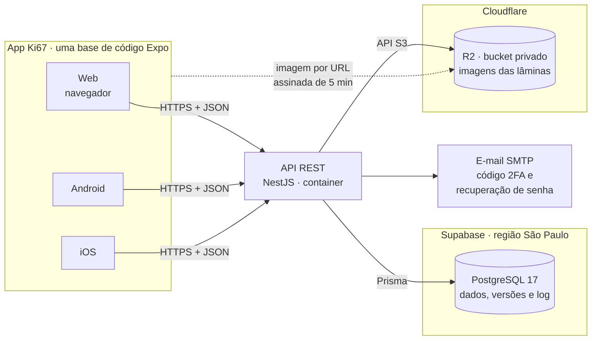

Em desenvolvimento, `npx supabase start` sobe na própria máquina o mesmo stack do Supabase (PostgreSQL, o painel Studio e o Mailpit, que captura os e-mails) em containers Docker, e as imagens ficam numa pasta privada da API. Em produção, a API usa o projeto Supabase na nuvem e o bucket no R2.

## 2. Camadas do app

Cada camada fala só com a vizinha. **A tela nunca chama a API diretamente**: ela usa o estado, que usa os serviços.

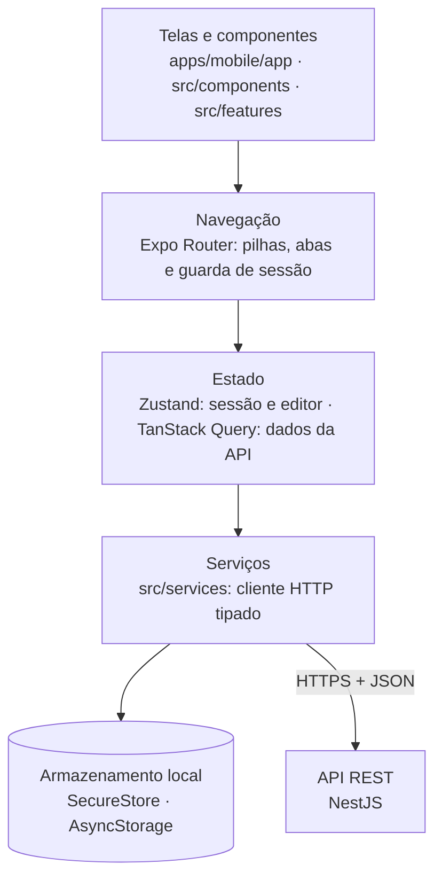

| Camada | Onde fica | Responsabilidade | Regra |
| --- | --- | --- | --- |
| Telas e componentes | `app/`, `src/components/`, `src/features/` | Desenhar a interface e capturar toques, cliques e gestos | Não conhece URL nem formato HTTP |
| Navegação | `app/_layout.tsx` e grupos `(auth)`, `(avaliador)`, `(validador)`, `(gestor)`, `(admin)` | Rotas, abas e redirecionamento de quem está sem sessão ou sem papel | A guarda de rota é conveniência; quem bloqueia de verdade é a API (RF-28) |
| Estado | `src/state/` (Zustand) e `src/queries/` (TanStack Query) | Sessão, editor (marcações, ferramenta e label ativas, desfazer e refazer) e cache dos dados da API | Fonte única da verdade para as telas |
| Serviços | `src/services/` | Chamadas HTTP validadas com os schemas de `packages/shared`, renovação do token e tratamento de erro | Única camada que fala com a API |
| Armazenamento local | `src/storage/` | Sessão (SecureStore ou cookie) e rascunho da análise aberta | Nunca guarda imagem nem dado de outro usuário |

## 3. Camadas da API

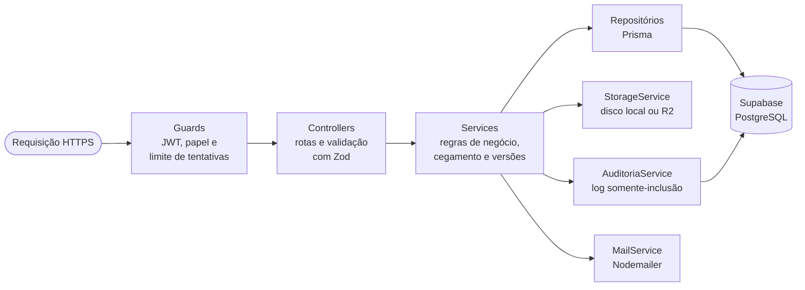

A API é dividida em módulos NestJS, um por área do domínio:

| Módulo | Responsabilidade | Requisitos |
| --- | --- | --- |
| `auth` | Login, código 2FA, sessão, recuperação de senha | RF-01 a RF-05 |
| `usuarios` | Cadastro, papéis e desativação | RF-06, RF-07 |
| `projetos` | Projetos, gestor designado, lotes e o N de avaliadores de cada lote | RF-09, RF-29 |
| `imagens` | Upload, hash, cópia reduzida e URL assinada | RF-08, RF-11, RF-36 |
| `preanotacao` | Núcleos azul-claros por limiar de cor, calculados uma vez por imagem | RF-17, RF-18 |
| `analises` | Atribuição, abas, marcações, índice, versões, finalização, histórico e restauração | RF-10, RF-12 a RF-16, RF-19 a RF-24, RF-26 a RF-28, RF-33 a RF-35 |
| `labels` | Labels e papel de cada uma no índice | RF-12, RF-41 |
| `validacao` | Fila, comparação das N análises, concordância e resultado | RF-30 a RF-32 |
| `auditoria` | Gravação e consulta do log | RF-37 a RF-39 |
| `exportacao` | JSON no formato do Labelme e CSV | RF-40 |
| `painel` | Progresso por avaliador e por lote | RF-25 |

## 4. Estrutura de pastas

O repositório é um monorepo com *npm workspaces*. O código entra a partir da Sprint 0 ([03 · Planejamento](03-planejamento.md)); esta é a estrutura planejada.

```text
ki67/
├── apps/
│   ├── mobile/                     # app Expo: web, Android e iOS
│   │   ├── app/                    # rotas do Expo Router (cada arquivo é uma tela)
│   │   │   ├── _layout.tsx         # provedores e guarda de sessão
│   │   │   ├── (auth)/             # login, código 2FA, recuperar senha
│   │   │   ├── (avaliador)/        # abas Pendentes e Avaliadas
│   │   │   ├── (validador)/        # fila e comparação das análises
│   │   │   ├── (gestor)/           # painel, lotes, atribuição, análises, exportação
│   │   │   ├── (admin)/            # usuários, projetos e gestores, logs
│   │   │   └── analise/[id].tsx    # tela de anotação
│   │   └── src/
│   │       ├── components/         # botões, cards, listas, campos
│   │       ├── features/anotacao/  # canvas Skia, gestos, ferramentas, desfazer/refazer
│   │       ├── state/              # stores Zustand
│   │       ├── queries/            # hooks do TanStack Query
│   │       ├── services/           # cliente HTTP: a única porta para a API
│   │       ├── storage/            # SecureStore e rascunho local
│   │       └── theme/              # cores, espaçamentos, tamanhos de toque
│   └── api/                        # API REST NestJS
│       ├── src/
│       │   ├── auth/  usuarios/  projetos/  imagens/  preanotacao/  analises/
│       │   ├── labels/  validacao/  auditoria/  exportacao/  painel/
│       │   └── common/             # guards, interceptors, filtros de erro
│       ├── prisma/                 # schema.prisma, migrações e seed
│       └── test/                   # testes e2e, incluindo a bateria de cegamento
├── packages/
│   └── shared/                     # tipos, schemas Zod, índice, concordância, formato Labelme
├── supabase/
│   └── config.toml                 # Supabase local: versão do Postgres, portas e SMTP do Mailpit
├── docs/                           # esta documentação
├── .env.example                    # variáveis de ambiente, sem segredos
└── package.json                    # workspaces e scripts da raiz
```

### Onde eu mexo para alterar isto?

| Quero alterar... | Mexo em... |
| --- | --- |
| Uma tela ou a navegação | `apps/mobile/app/` (cada arquivo é uma rota) |
| Um componente visual reutilizável | `apps/mobile/src/components/` |
| O desenho, os gestos ou as ferramentas do canvas (ponto, caixa, polígono) | `apps/mobile/src/features/anotacao/` |
| Uma chamada à API | `apps/mobile/src/services/` (a tela nunca usa `fetch` direto) |
| O que fica salvo no aparelho | `apps/mobile/src/storage/` |
| Cores, fontes e tamanho mínimo de toque | `apps/mobile/src/theme/` |
| Uma regra de negócio (quem pode ver ou fazer o quê) | `apps/api/src/<módulo>/<módulo>.service.ts` e os guards em `apps/api/src/common/` |
| O limiar de cor da pré-anotação | `apps/api/src/preanotacao/` |
| Uma tabela ou coluna do banco | `apps/api/prisma/schema.prisma`, gerando uma migração nova. As migrações do Prisma são a única fonte do esquema: não crie tabelas pelo painel do Supabase |
| O formato das marcações, o índice ou a concordância | `packages/shared/` (usado pelo app e pela API) |
| Versão do PostgreSQL, portas ou e-mail do ambiente local | `supabase/config.toml` (o `major_version` precisa ser igual ao do projeto na nuvem) |
| Uma variável de ambiente | `.env.example`, com comentário explicando o valor |

## 5. Mapa de navegação

As telas se agrupam como no Expo Router: uma pilha de autenticação e um grupo por papel. A seta pontilhada é a saída por logout ou sessão expirada, que vale para qualquer tela logada; telas com borda tracejada entram na fase 2.

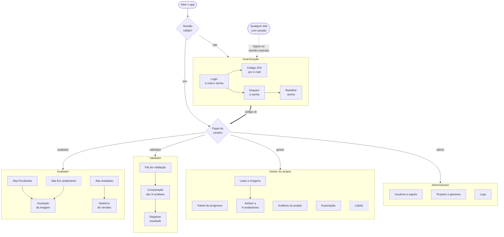

Quem tem mais de um papel troca de perfil pelo menu da conta, sem novo login.

## 6. Fluxos com a API

O fluxograma mostra por onde se passa; os diagramas de sequência mostram quem fala com quem e em que ordem, **incluindo os caminhos de erro**.

### 6.1 Login com segundo fator por e-mail (RF-01, RF-02, RF-37)


### 6.2 Upload de imagens pelo gestor, com pré-anotação (RF-08, RF-11, RF-17, RF-18)

A pré-anotação é calculada uma única vez por versão da imagem e guardada, para que todos os avaliadores recebam exatamente a mesma sugestão ([D10](#12-decisões-de-arquitetura)).

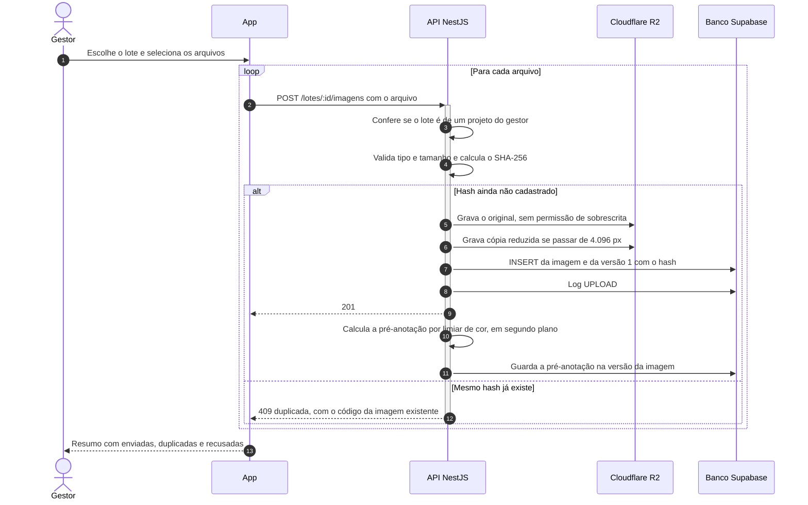

### 6.3 Abrir uma imagem atribuída: cegamento, pré-anotação e URL assinada (RF-18, RF-27, RF-28, RNF-06)

É aqui que o cegamento é garantido: a busca já nasce filtrada pelo dono, e a imagem só é entregue por uma URL que expira.

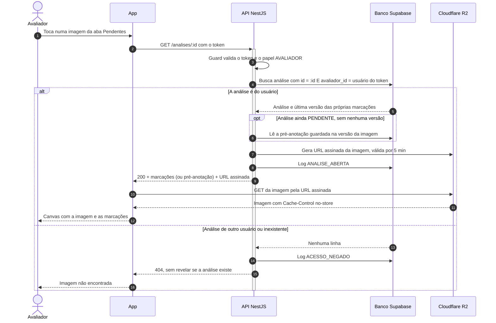

No driver local de desenvolvimento, a própria API serve o arquivo depois de conferir a assinatura da URL; no R2, a URL é pré-assinada pela API S3 do Cloudflare.

### 6.4 Salvar e finalizar a análise: versionamento sem perda (RF-21, RF-33, RNF-05)

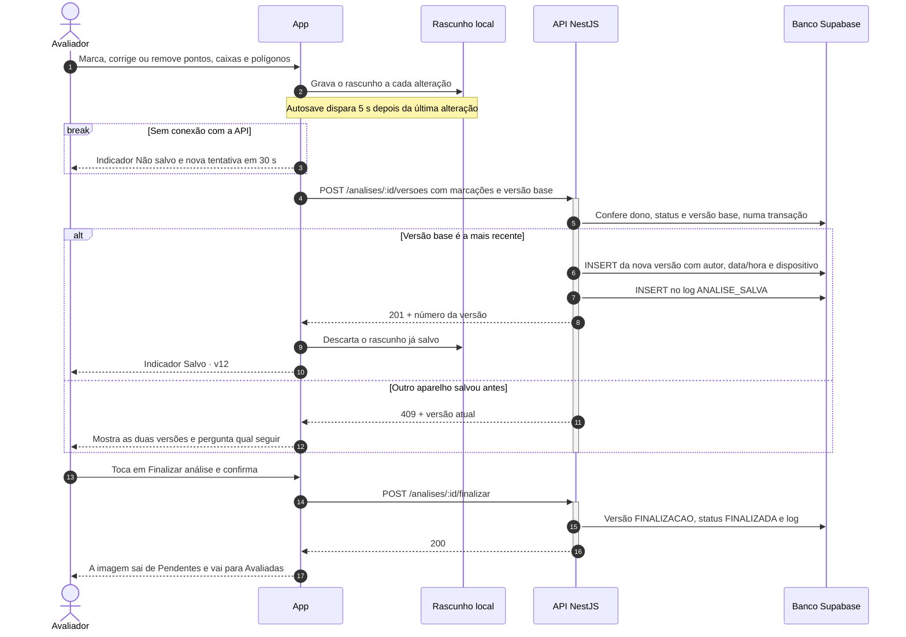

### 6.5 Comparação das análises e resultado (RF-30, RF-31, RF-32, RN-05, RN-08)

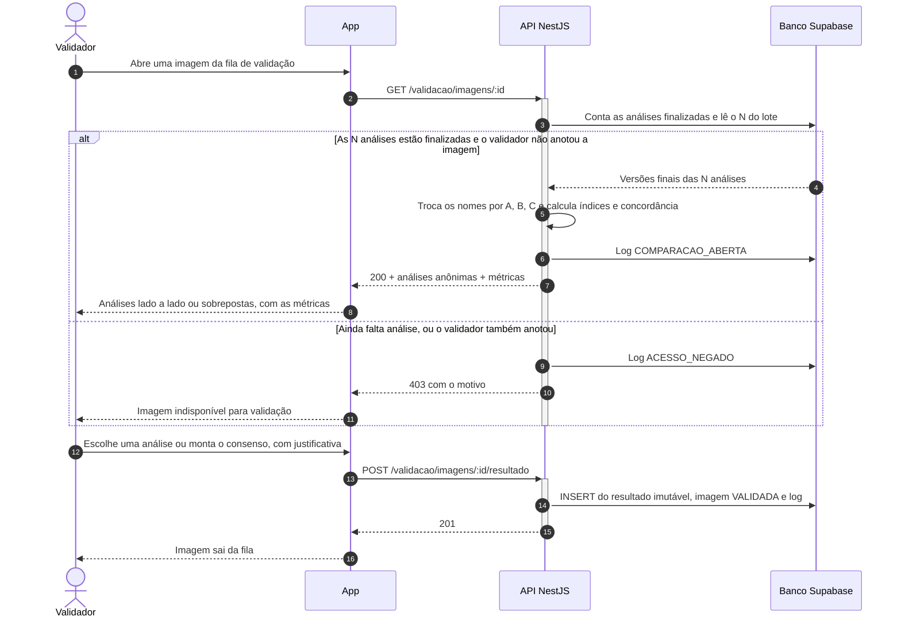

## 7. Ciclos de vida

Uma **análise** (o trabalho de um avaliador sobre uma imagem) passa por três estados:

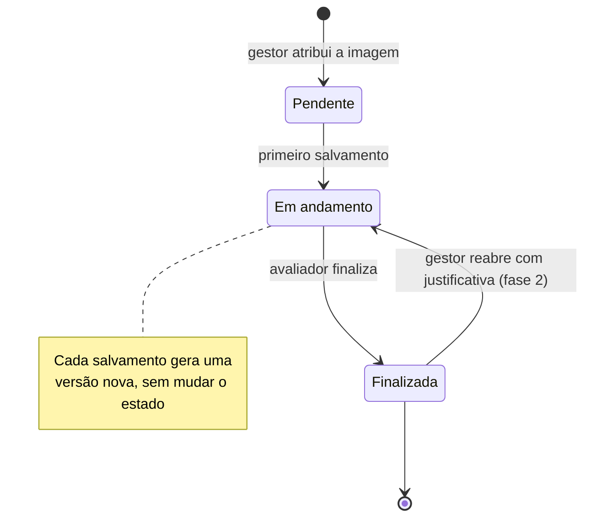

Uma **imagem** de um lote com N igual a 2 ou mais só vai para comparação quando as N análises estiverem finalizadas (RN-05). Com N igual a 1, ela termina quando a única análise é finalizada.

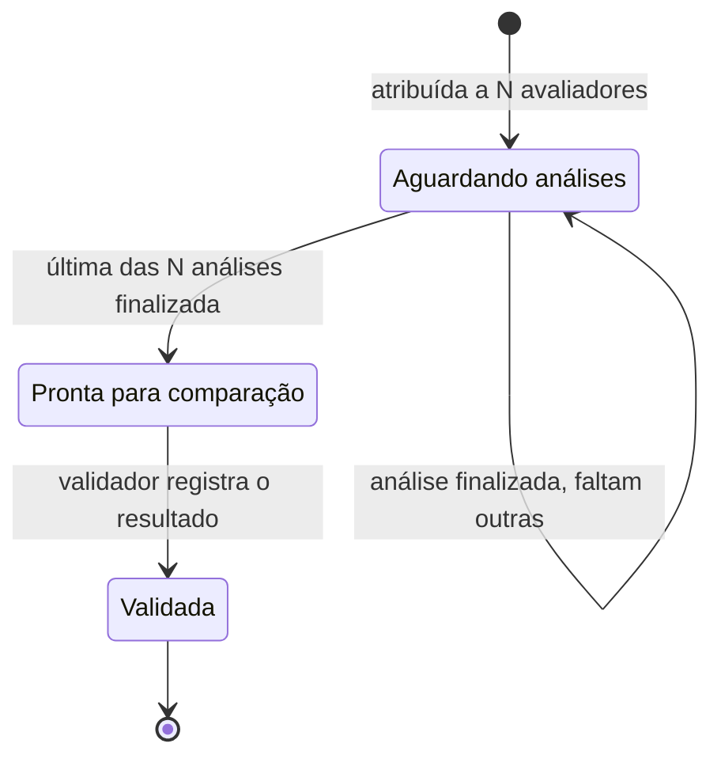

## 8. Modelo de dados

O modelo está dividido em dois desenhos para continuar legível. No primeiro, o domínio da anotação. As colunas `*_por` e `autor_id` também apontam para `USUARIO`, mas essas ligações ficaram fora do desenho. As marcações referenciam a `LABEL` pelo id, dentro do JSON.

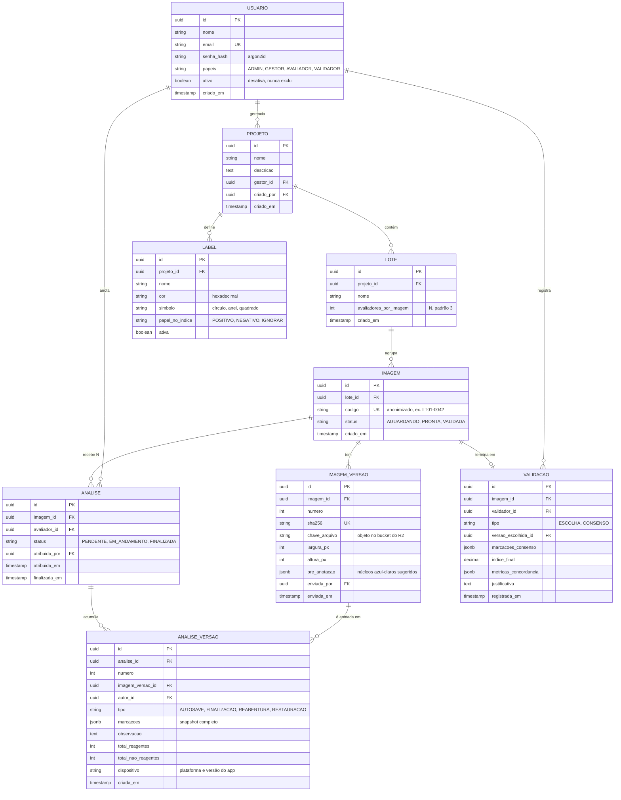

No segundo, sessão, códigos de verificação e o log de auditoria:

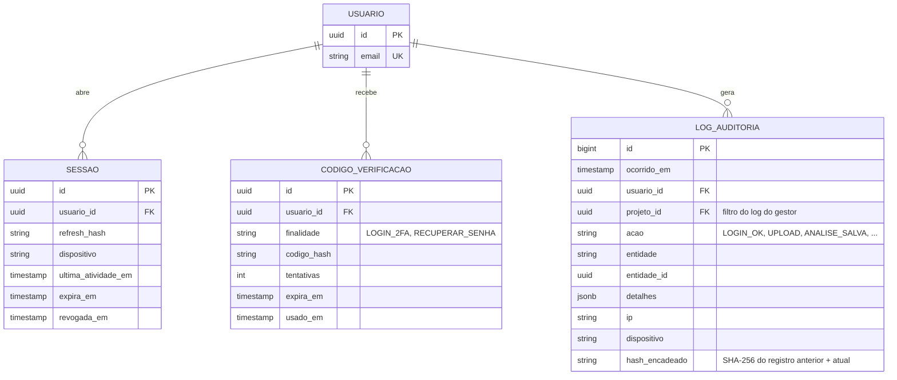

As marcações de cada versão (e a pré-anotação de cada imagem) ficam num JSONB com este formato, definido uma vez em `packages/shared` e usado pelo app e pela API. As coordenadas são **pixels da imagem original**, nunca da tela ([D5](#12-decisões-de-arquitetura)):

```ts
type Origem = 'manual' | 'pre_anotacao' | 'pre_anotacao_editada'; // premissa da Q2

type Marcacao =
  | { id: string; tipo: 'ponto'; labelId: string; origem: Origem; x: number; y: number }
  | { id: string; tipo: 'retangulo'; labelId: string; origem: Origem; x: number; y: number; largura: number; altura: number }
  | { id: string; tipo: 'poligono'; labelId: string; origem: Origem; pontos: Array<[number, number]> };
```

Garantias que o próprio banco impõe, além da aplicação:

| Garantia | Como | Requisito |
| --- | --- | --- |
| Uma análise por par (imagem, avaliador) | `UNIQUE (imagem_id, avaliador_id)` em `ANALISE` | RF-26 |
| Cada imagem recebe exatamente N avaliadores | Verificação no service e trigger que compara a contagem com `LOTE.avaliadores_por_imagem` | RF-29 |
| Gestor não avalia no próprio projeto | Verificação no service na atribuição e trigger que compara `avaliador_id` com `PROJETO.gestor_id` | RN-07 |
| Versões numeradas e imutáveis | `UNIQUE (analise_id, numero)`; o usuário de banco da API não tem `UPDATE` nem `DELETE` em `ANALISE_VERSAO` | RF-33 |
| Log que ninguém altera | Trigger que rejeita `UPDATE` e `DELETE`, permissão só de `INSERT` e `SELECT` e hash encadeado entre registros | RF-38 |
| Original imutável | `sha256` único e objeto gravado uma única vez no R2, sem rota de sobrescrita | RF-11 |
| Só a API chega aos dados | RLS ligado em todas as tabelas, sem nenhuma política, e Data API do Supabase desativada: o PostgREST não lê nem grava nada | RF-28 |

## 9. API REST

Todas as rotas ficam sob o prefixo `/api/v1` (omitido abaixo), recebem e devolvem JSON e usam datas ISO 8601 em UTC. Erros seguem o formato `{ "codigo": "...", "mensagem": "..." }`. "Gestor" sempre significa o gestor **do projeto** daquele recurso.

| Método | Rota | Quem pode | Requisitos |
| --- | --- | --- | --- |
| `POST` | `/auth/login` | Público | RF-01 |
| `POST` | `/auth/2fa/verificar` | Público, com o `desafioId` do login | RF-02 |
| `POST` | `/auth/refresh`, `/auth/logout` | Sessão ativa | RF-05 |
| `POST` | `/auth/senha/esqueci`, `/auth/senha/redefinir` | Público | RF-03 |
| `GET` `POST` `PATCH` | `/usuarios`, `/usuarios/:id` | Admin | RF-04, RF-06, RF-07 |
| `GET` `POST` `PATCH` | `/projetos`, `/projetos/:id` | Criar e designar gestor: admin · ler: admin e gestor | RF-09 |
| `GET` `POST` | `/projetos/:id/lotes` | Gestor | RF-09, RF-29 |
| `POST` | `/lotes/:id/imagens` | Gestor | RF-08, RF-11, RF-17 |
| `POST` | `/atribuicoes` | Gestor | RF-10, RF-29 |
| `GET` | `/me/analises?status=` | Avaliador | RF-22 a RF-24 |
| `GET` | `/analises/:id` | Dono da análise | RF-18, RF-27, RF-28 |
| `POST` | `/analises/:id/versoes` | Dono da análise | RF-21, RF-33 |
| `POST` | `/analises/:id/finalizar` | Dono da análise | RF-21 |
| `GET` | `/analises/:id/versoes`, `/analises/:id/versoes/:n` | Dono, validador e gestor | RF-34 |
| `POST` | `/analises/:id/versoes/:n/restaurar` | Dono da análise | RF-34 |
| `POST` | `/analises/:id/reabrir` | Gestor (fase 2) | RF-42 |
| `GET` | `/projetos/:id/progresso` | Gestor | RF-25 |
| `GET` `POST` `PATCH` | `/projetos/:id/labels` | Leitura: todos do projeto · escrita: gestor (fase 2) | RF-12, RF-41 |
| `GET` | `/validacao/fila` | Validador | RF-30 |
| `GET` | `/validacao/imagens/:id` | Validador e gestor | RF-30, RF-31 |
| `POST` | `/validacao/imagens/:id/resultado` | Validador | RF-32 |
| `GET` | `/auditoria?usuario=&imagem=&de=&ate=` | Admin (tudo) e gestor (só o próprio projeto) | RF-39 |
| `GET` | `/exportacao/lotes/:id?formato=` (`labelme` ou `csv`) | Gestor | RF-40 |

Nenhuma rota de `DELETE` existe para usuários, projetos, análises, versões ou logs (RN-06).

## 10. Segurança e cegamento

O cegamento (RF-26 a RF-28) é garantido em quatro níveis, do mais externo ao mais interno:

1. **Quem é você.** Token de acesso JWT de 15 min e refresh token rotativo, guardado só como hash na tabela `SESSAO`. A sessão expira depois de 30 min sem atividade (RF-05) e pode ser revogada.
2. **O que você pode fazer.** Um guard de papel protege toda rota; rota sem papel declarado é negada por padrão.
3. **O que você pode ver.** Todo repositório que busca análises recebe o id do usuário e filtra por ele; toda consulta do gestor é filtrada pelos projetos que ele gerencia. As respostas para o avaliador usam DTOs que nem têm campos de outros usuários, e a comparação entrega as análises como A, B, C, sem nomes. Pedir a análise de outra pessoa devolve **404, e não 403**, para não confirmar que ela existe.
4. **Como provamos.** A bateria e2e de cegamento ([cenários críticos](01-visao-e-requisitos.md#6-cenários-críticos)) roda no CI a cada pull request.

### O Supabase e o R2 não são portas de entrada

Todo projeto Supabase publica as tabelas do esquema `public` numa API REST automática (Data API, via PostgREST). Se isso ficasse aberto, alguém poderia ler as análises sem passar pelas regras da nossa API e furar o cegamento. Por isso:

- a **Data API fica desativada** no projeto, e o **RLS fica ligado em todas as tabelas, sem nenhuma política**, como segunda barreira caso ela seja reativada por engano;
- o **app não recebe nenhuma chave do Supabase** (nem `anon`, nem `service_role`) **nem do R2**; só a API tem a string de conexão e as credenciais do bucket, no `.env` do servidor;
- o bucket do R2 é **privado**, sem domínio público: uma imagem só é lida por URL pré-assinada de 5 min, gerada pela API depois de conferir o acesso;
- a API se conecta com o usuário de banco `ki67_api`, que não tem `UPDATE` nem `DELETE` no log e nas versões; o usuário `postgres` só roda migrações;
- o Supabase Auth não é usado: login, 2FA por e-mail e sessão ficam na API ([D3](#12-decisões-de-arquitetura)).

Também valem: senhas com argon2id; no máximo 5 tentativas de login ou de código a cada 15 min; mensagens de erro genéricas; HTTPS obrigatório fora do ambiente local; CORS só para a origem do app web; cabeçalhos de segurança com `helmet`; respostas de imagem com `Cache-Control: no-store`; e log com trigger, permissões e hash encadeado.

### Sessão em cada plataforma

| | Android e iOS | Web |
| --- | --- | --- |
| Token de acesso (15 min) | Memória | Memória |
| Refresh token | SecureStore (Keychain no iOS, Keystore no Android) | Cookie `httpOnly`, `Secure`, `SameSite=Strict`, definido pela API |
| Rascunho da análise aberta | AsyncStorage | AsyncStorage (localStorage do navegador) |
| No logout | Apaga a sessão e o rascunho | A API invalida o cookie e o app apaga o rascunho |

## 11. Bibliotecas e o papel de cada uma

Versões fixadas pelo Expo SDK 57 (`npx expo install` escolhe as compatíveis) e as estáveis mais recentes para a API.

| Biblioteca | Versão | Onde | Papel no Ki67 |
| --- | --- | --- | --- |
| Expo SDK | 57 | app | Toolchain, módulos nativos e build para web, Android e iOS a partir do mesmo código |
| React Native + React Native Web | 0.86 / 0.21 | app | Componentes nativos no celular e HTML na web |
| Expo Router | 57 | app | Rotas por arquivo, sobre o React Navigation; URLs reais na web e grupos de telas por papel |
| @shopify/react-native-skia | 2.6 | app | Desenha a imagem e milhares de pontos, caixas e polígonos na GPU; na web usa CanvasKit (WebAssembly) |
| Gesture Handler + Reanimated | 2.32 / 4.5 | app | Pinça, pan, arrasto de caixas e toque longo processados fora da thread de JavaScript, sem engasgos |
| Zustand | 5.0 | app | Estado do editor (marcações, ferramenta e label ativas, pilha de desfazer e refazer) e da sessão |
| TanStack Query | 5 | app | Cache, nova tentativa e invalidação dos dados vindos da API |
| expo-secure-store | 57 | app | Refresh token no Keychain e no Keystore |
| AsyncStorage | 2.2 | app | Rascunho da análise aberta |
| expo-document-picker | 57 | app | Seletor de arquivos do sistema para o upload, sem pedir permissão |
| Zod | 4 | shared | Schemas das marcações e das requisições, validados com o mesmo código no app e na API |
| NestJS | 12 | api | Módulos, guards de papel, interceptors de auditoria e injeção de dependência |
| Prisma ORM | 7.10 | api | Schema do banco, migrações versionadas e consultas tipadas |
| Supabase (PostgreSQL gerenciado) | PostgreSQL 17 | banco | Banco na nuvem com backups, painel e região em São Paulo |
| Supabase CLI | 2 | dev | Sobe o mesmo stack local com `npx supabase start`: PostgreSQL, Studio e Mailpit |
| Cloudflare R2 | — | imagens | Bucket privado das imagens, compatível com a API S3 e sem cobrança de tráfego de saída |
| AWS SDK v3 (`client-s3`) | 3 | api | Cliente S3 que fala com o R2: grava os originais e gera as URLs pré-assinadas |
| argon2 | 0.45 | api | Hash das senhas |
| sharp | 0.35 | api | Lê dimensões, metadados e pixels: gera a cópia reduzida e alimenta a pré-anotação por limiar de cor |
| Nodemailer | 10 | api | Envio do código 2FA e do link de recuperação por SMTP |
| Jest, jest-expo, Testing Library, Supertest | 30 / 57 / 14 / 7 | todos | Testes de unidade, de componentes e e2e da API |

## 12. Decisões de arquitetura

| # | Decisão | Por quê | Alternativas descartadas |
| --- | --- | --- | --- |
| D1 | Expo + React Native, com React Native Web no navegador | Uma base para três plataformas (RNF-01), e é a stack da disciplina | Flutter (bom canvas, mas fora da stack da disciplina); PWA pura (gestos e armazenamento seguro limitados no iOS) |
| D2 | Canvas com Skia | Milhares de marcações na GPU e o mesmo código na web (RNF-03) | `react-native-svg` (um elemento por marcação pesa acima de algumas centenas); WebView com canvas HTML (duas bases de código de anotação) |
| D3 | Regras de negócio numa API própria em NestJS; o Supabase entra só como banco | 2FA por e-mail, cegamento, versões e log num lugar só e testável (RF-02, RF-28) | App falando direto com o Supabase (Auth + RLS): o 2FA por e-mail não é nativo no Supabase Auth e as regras de cegamento ficariam espalhadas em políticas de banco; Firebase (mesmos motivos, e banco NoSQL) |
| D4 | Cada versão é um snapshot imutável das marcações (JSONB) | Histórico, restauração e diff simples; nada é sobrescrito (RF-33 a RF-35) | Tabela de marcações com `UPDATE` (perde histórico); event sourcing (complexo demais para o prazo) |
| D5 | Coordenadas em pixels da imagem original | Não dependem de tela nem de zoom, o que garante a paridade (RNF-02) e a exportação direta para o formato do Labelme | Coordenadas relativas à tela |
| D6 | Log no próprio PostgreSQL, com trigger, permissões e hash encadeado | O somente-inclusão é garantido pelo banco, não só pela aplicação (RF-38) | Arquivo de log no servidor (fácil de editar); serviço externo (custo e dependência) |
| D7 | Imagens no Cloudflare R2, atrás de uma interface de armazenamento (disco local em desenvolvimento) | Bucket privado com URL pré-assinada pela API S3, sem cobrança de tráfego de saída, o que importa para imagens grandes abertas várias vezes; o desenvolvimento roda sem conta em nuvem | Supabase Storage (concentraria banco e arquivos num só plano gratuito); disco do servidor da API (backup e escala por conta do grupo) |
| D8 | Monorepo com npm workspaces e pacote `shared` | Tipos, schemas, índice e concordância iguais no app e na API | Repositórios separados (tipos duplicados e versões descasadas) |
| D9 | Banco PostgreSQL gerenciado no Supabase | PostgreSQL completo, então triggers, permissões e JSONB (D4, D6) continuam valendo; backups, painel e região em São Paulo prontos; plano gratuito para o semestre; o Supabase CLI sobe o mesmo banco em qualquer máquina | PostgreSQL em container próprio (instalação, backup e atualização por conta do grupo); Firebase (NoSQL, sem joins nem triggers) |
| D10 | Pré-anotação calculada uma vez por versão da imagem, no upload, e guardada | Todos os avaliadores recebem exatamente a mesma sugestão, o que permite medir o viés dela (Q2), e abrir a imagem não espera processamento | Calcular no aparelho a cada abertura (resultados diferentes por plataforma e lento no celular) |
| D11 | Papel de gestor do projeto separado do administrador | Quem conduz o estudo (patologista líder ou pesquisador principal) organiza o próprio projeto, e o administrador do sistema não precisa ver nenhuma anotação | Administrador fazendo tudo (concentra acesso e não escala para vários estudos) |

---

| Versão | Data | Mudança |
| --- | --- | --- |
| 0.1 | 07/10/2026 | Arquitetura inicial: camadas, navegação, sequências, ciclos de vida, dados, API e decisões. |
| 0.2 | 07/10/2026 | Banco passa a ser o Supabase (D9): visão geral, pastas, segurança da Data API e RLS, bibliotecas e D3/D7 revistas. |
| 0.3 | 07/10/2026 | Retorno do professor: papéis de avaliador e gestor (D11), projetos e N avaliadores por lote, pré-anotação no upload (D10), sequência de comparação, imagens no Cloudflare R2 (D7) e COCO removido. |
