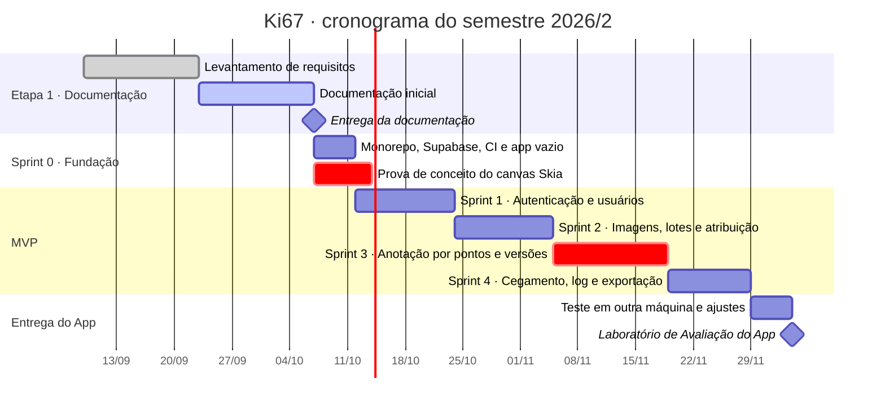
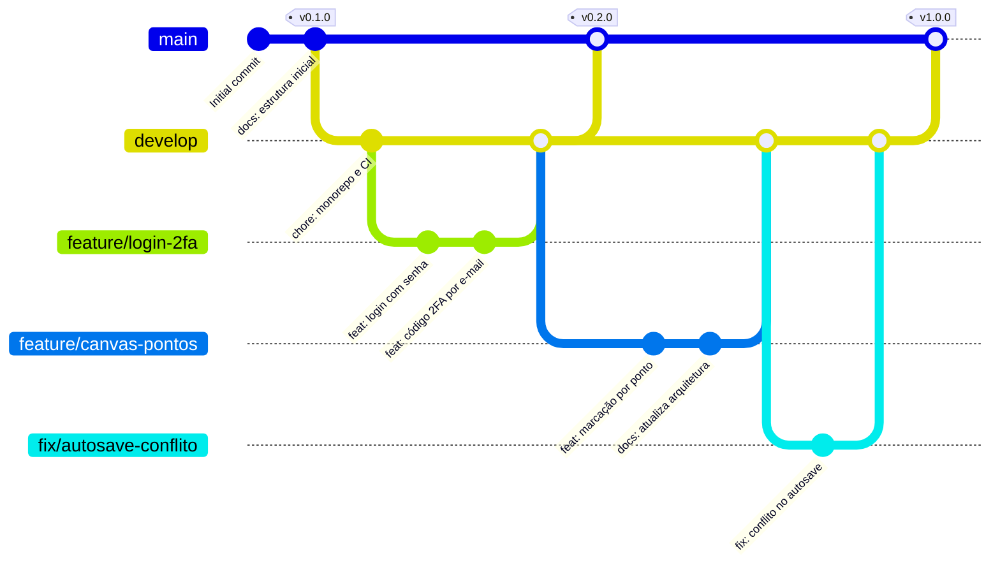

# 03 · Planejamento

> **Documento vivo.** Versão 0.2, de 07/10/2026. Cronograma, organização do repositório e regras de trabalho do grupo. Quando uma data ou uma regra mudar, este arquivo muda no mesmo pull request.

**Neste documento:** [1. Marcos](#1-marcos-e-entregas) · [2. Cronograma](#2-cronograma) · [3. Backlog por sprint](#3-backlog-do-mvp-por-sprint) · [4. Branches](#4-estratégia-de-branches) · [5. Commits](#5-convenção-de-commits) · [6. Definition of Done](#6-definition-of-done) · [7. Riscos](#7-riscos) · [8. Licença](#8-licença)

---

## 1. Marcos e entregas

| Marco | Data prevista | O que é entregue | Tag |
| --- | --- | --- | --- |
| **Etapa 1 · Documentação** | 07/10/2026 | README, LICENSE, `.env.example` e os três documentos de `docs/` | `v0.1.0` |
| Sprint 0 · Fundação | 14/10/2026 | Monorepo que roda do zero nas três plataformas; desempenho do canvas medido | — |
| Sprint 1 · Autenticação | 24/10/2026 | Login com 2FA, recuperação de senha e gestão de usuários | `v0.2.0` |
| Sprint 2 · Imagens | 05/11/2026 | Upload com hash, lotes, atribuição, abas e painel | `v0.3.0` |
| Sprint 3 · Anotação | 19/11/2026 | Anotação por pontos com autosave, versões e histórico | `v0.4.0` |
| Sprint 4 · Confiança | 29/11/2026 | Bateria de cegamento, auditoria completa e exportação | `v0.5.0` |
| **Laboratório de Avaliação do App** | 04/12/2026 *(a confirmar)* | MVP avaliado pelos outros grupos | `v1.0.0` |

As datas depois da Etapa 1 são estimativas. Quando o professor publicar a data do Laboratório de Avaliação, só o marco final muda: as tarefas do cronograma dependem umas das outras (`after`) e se reorganizam sozinhas.

## 2. Cronograma



Barras vermelhas formam o caminho crítico: a anotação (Sprint 3) só começa quando a prova de conceito do canvas confirmar que o Skia aguenta 2.000 pontos a 30 fps num celular intermediário (RNF-03). Se não aguentar, a [decisão D2](02-arquitetura.md#12-decisões-de-arquitetura) é revista antes de escrever a tela de anotação.

A fase 2 ([escopo](01-visao-e-requisitos.md#4-escopo-por-fase)) não tem data: entra depois do Laboratório de Avaliação, se o projeto continuar.

## 3. Backlog do MVP por sprint

| Sprint | Objetivo | Requisitos | Pronto quando |
| --- | --- | --- | --- |
| 0 · Fundação | Um esqueleto que roda do zero nas três plataformas | RNF-01, RNF-03 (prova de conceito), RNF-13 | `npm run dev:app` abre na web, no Android e no iOS; a API responde em `/api/v1/saude` conectada ao Supabase local; o projeto Supabase na nuvem existe (região São Paulo, Data API desativada); o CI está verde; o canvas com 2.000 pontos foi medido |
| 1 · Autenticação e usuários | Entrar com segurança e gerenciar a equipe | RF-01 a RF-07; RF-37 para os eventos de login | Login, 2FA e recuperação de senha passam nos critérios; o admin cria, edita e desativa usuários |
| 2 · Imagens e atribuição | O admin distribui o trabalho | RF-08 a RF-11, RF-22, RF-24, RF-25 | Upload em lote com hash, atribuição por lote, abas e painel com dados reais |
| 3 · Anotação | O núcleo do produto | RF-12, RF-15, RF-16, RF-20, RF-21, RF-33, RF-34 | Anotar, salvar, finalizar e restaurar versões na web e no celular |
| 4 · Confiança e saída | Provar o cegamento, fechar a auditoria e exportar | RF-26 a RF-28 (bateria e2e), RF-37 a RF-39, RF-40 | Bateria de cegamento no CI, log consultável e exportação que abre no Labelme |
| Entrega | O app roda fora da máquina do grupo | Todos do MVP | Outro grupo roda o app só com o README; capturas reais no README; tag `v1.0.0` |

O cegamento (RF-26 a RF-28) vale desde a Sprint 2, porque toda consulta de análise já nasce filtrada pelo dono; a Sprint 4 fecha a bateria de testes que prova isso.

O trabalho é acompanhado num quadro do GitHub Projects (Backlog → Em andamento → Em revisão → Pronto). Cada card é uma issue com o RF no título, e o pull request que a resolve fecha a issue com `Closes #<número>`.

## 4. Estratégia de branches

A `main` guarda o que foi entregue, a `develop` integra, e cada mudança nasce e morre na própria branch, entrando por pull request.



| Branch | Para quê | Nasce de | Volta para | Regras |
| --- | --- | --- | --- | --- |
| `main` | O que foi entregue e pode ser avaliado | — | — | Protegida: sem push direto. Recebe a `develop` ao fim de cada sprint, com tag |
| `develop` | Integração do trabalho da sprint | `main` | `main` | Só recebe pull request com CI verde |
| `feature/<assunto>` | Funcionalidade nova | `develop` | `develop` | Apagada depois do merge |
| `fix/<assunto>` | Correção de bug | `develop` | `develop` | Apagada depois do merge |
| `docs/<assunto>` | Mudança só de documentação | `develop` | `develop` | Apagada depois do merge |

O nome da branch descreve **a mudança, não o autor**: `feature/login-2fa`, `fix/autosave-conflito`, `docs/rf-07`.

**Pull request:**

- título no padrão de commit da [seção 5](#5-convenção-de-commits) e descrição citando os requisitos (por exemplo, "Implementa RF-02") e a issue (`Closes #12`);
- pelo menos **1 aprovação** de outro integrante;
- CI verde: lint, checagem de tipos, testes e build web;
- documentação atualizada no mesmo PR quando o comportamento muda;
- merge com *merge commit*, para o histórico mostrar de onde veio cada funcionalidade, como no diagrama.

## 5. Convenção de commits

Seguimos [Conventional Commits](https://www.conventionalcommits.org/pt-br/v1.0.0/): o histórico fica legível sem abrir o diff.

```text
<tipo>(<escopo opcional>): <descrição curta, em minúsculas e sem ponto final>
```

| Tipo | Quando usar | Exemplo no Ki67 |
| --- | --- | --- |
| `feat` | Nova funcionalidade | `feat(anotacao): marcação por ponto com label (RF-12)` |
| `fix` | Correção de bug | `fix(auth): código 2FA expirado era aceito` |
| `docs` | Só documentação | `docs: critério de aceitação do RF-07` |
| `refactor` | Muda o código sem mudar o comportamento | `refactor(api): extrai o serviço de versionamento` |
| `test` | Cria ou corrige testes | `test(cegamento): patologista não acessa análise alheia` |
| `chore` | Build, dependências e configuração | `chore: atualiza dependências do Expo SDK 57` |
| `ci` | Pipeline de integração contínua | `ci: roda lint e testes no pull request` |

- O **escopo** é a área afetada: `auth`, `usuarios`, `imagens`, `anotacao`, `cegamento`, `auditoria`, `exportacao`, `app`, `api`, `shared`.
- Cite o requisito entre parênteses quando o commit o implementa ou altera.
- Mudança que quebra compatibilidade leva `!` depois do tipo: `feat(api)!: rota de versões passa a exigir versão base`.
- Mudança de comportamento leva o documento junto, no mesmo commit ou no mesmo PR.

## 6. Definition of Done

Uma tarefa só fecha quando **todos** os itens batem. Código alterado com documento intacto é mudança incompleta, e não tarefa pronta.

- [ ] Código escrito e revisado por outro integrante (pull request aprovado)
- [ ] Testes passando no CI, incluindo os novos para o que mudou
- [ ] Critério de aceitação do requisito atendido ([01 · Visão e requisitos](01-visao-e-requisitos.md#5-requisitos-funcionais))
- [ ] Documentação atualizada no mesmo PR: requisito, arquitetura ou README
- [ ] Testado na web e em pelo menos uma plataforma móvel (RNF-02)
- [ ] O projeto continua rodando do zero em outra máquina seguindo só o README

## 7. Riscos

| Risco | Impacto | Como reduzimos |
| --- | --- | --- |
| Canvas lento com milhares de pontos na web ou em celulares intermediários | Alto | Prova de conceito na Sprint 0, antes de escrever a tela de anotação; Skia com desenho em lote e só da área visível |
| Perguntas em aberto (Q1 a Q10) mudarem o escopo | Médio | Premissas registradas em [01 · Visão e requisitos](01-visao-e-requisitos.md#11-perguntas-em-aberto) e escolhidas para serem baratas de mudar; revisão com o cliente na Sprint 1 |
| As imagens reais serem lâminas inteiras (WSI) | Alto | MVP limitado a campos capturados; WSI com tiles só na fase 2 |
| Dados sensíveis de pacientes (LGPD e CEP) | Alto | Só imagens anonimizadas; nenhuma imagem real no repositório; desenvolvimento com imagens sintéticas ou de bases públicas |
| Limites do plano gratuito do Supabase (projeto pausado depois de dias sem uso, cotas de banco e sem backup automático) | Médio | Desenvolvimento no Supabase local; `pg_dump` agendado no CI; revisar o plano antes de usar imagens reais do estudo |
| Prazo do semestre | Médio | MVP enxuto e fase 2 explicitamente fora do semestre |
| Integrante indisponível | Médio | Pull requests pequenos, revisão cruzada e documentação viva, para ninguém ser o único que sabe uma parte |

## 8. Licença

**MIT**, porque é curta, permissiva e deixa a instituição e outros grupos de pesquisa reutilizarem e adaptarem o código exigindo apenas que o aviso de copyright seja mantido. A Apache 2.0 seria a alternativa se houvesse preocupação com patentes, e a GPL foi descartada porque obrigaria quem integrasse o código a sistemas da instituição a abrir esses sistemas sob a mesma licença. A licença cobre só o código: imagens e anotações são dados de pesquisa, ficam fora do repositório e seguem o protocolo do estudo.

---

| Versão | Data | Mudança |
| --- | --- | --- |
| 0.1 | 07/10/2026 | Cronograma, backlog por sprint, branches, commits, Definition of Done, riscos e licença. |
| 0.2 | 07/10/2026 | Sprint 0 passa a configurar o Supabase; novo risco sobre o plano gratuito. |
